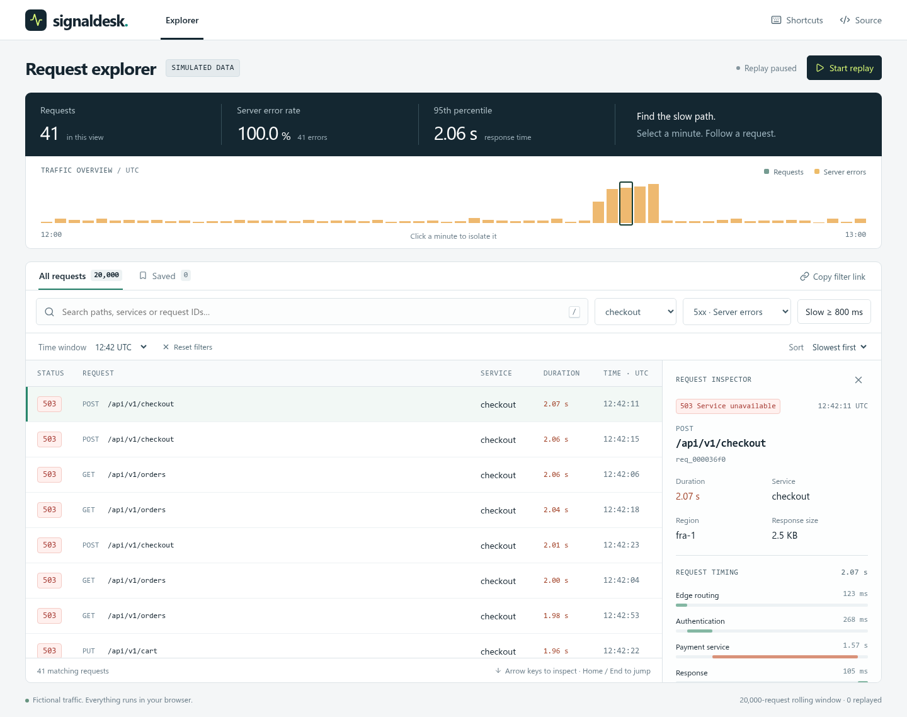

# SignalDesk

[](https://github.com/MilanG-Ne/signaldesk/actions/workflows/ci.yml)

**Find the slow path in 20,000 requests.** SignalDesk is a browser-only request explorer: isolate a traffic spike, combine filters, inspect a timing waterfall, and save the requests worth returning to.

The traffic is fictional. The interaction is real. No backend, API key, or service account is required.



## Run it

Use Node.js 24 and pnpm 11.19.0.

```sh
git clone https://github.com/MilanG-Ne/signaldesk.git
cd signaldesk
corepack enable
corepack prepare pnpm@11.19.0 --activate
pnpm install --frozen-lockfile
pnpm dev
```

Open **[127.0.0.1:3002](http://127.0.0.1:3002)**.

For the production build, run `pnpm build` and then `pnpm preview`. The output in `dist/` is a portable static site. The included Sites manifest is only deployment metadata for the maintainer's preview; it is not required to run the project or use another static host.

## A two-minute investigation

1. Filter to **checkout**. A burst of server errors appears around **12:40–12:45 UTC**.
2. Choose **5xx · Server errors** and sort by **Slowest first**.
3. Select a row. The inspector shows the request's timing, response, and slow application span.
4. Save the request, reload, and open **Saved**. It stays on this browser even if it has left the rolling replay window.
5. Start replay to add traffic. Moving into, focusing, or scrolling the list pauses it so the evidence stays still.

Click a timeline minute to isolate it, or use the equivalent **Time window** selector. **Copy filter link** preserves the filters; it does not share your device's saved collection. Replayed events beyond the initial fixture require replaying to that point again on a fresh page.

## Why this is a React project

The interesting parts are in the interaction and lifecycle, not a large backend:

| Concern | Implementation |
| --- | --- |
| Many rows, few DOM nodes | TanStack Virtual renders the viewport and a small overscan region, with stable request IDs. Keyboard navigation can jump to the 20,000th request. |
| Responsive search | `useDeferredValue` separates the controlled input from list filtering. Memoized derived data and list props let urgent input updates skip expensive work. |
| A stream outside React | A small `useSyncExternalStore` adapter publishes immutable, cached snapshots. It owns one timer, bounds retained data, and cleans up after the last subscriber. |
| Local persistence | A second external-store adapter handles saved requests, cross-tab storage events, corrupt data, storage denial, and a 100-item limit. |
| Shareable state | Validated URL parameters encode text, service, status, latency, sort order, and the chosen minute. |
| Keyboard and narrow screens | Roving timeline focus, virtual-list navigation, visible focus, an equivalent minute selector, and a mobile inspector with focus restoration. |
| Confidence | Unit/component tests cover filtering and lifecycle boundaries; Playwright exercises complete interactions against the real app. |

There is no global state framework, server-state cache, or web worker: this bounded dataset does not need them. The [architecture notes](docs/architecture.md) explain the choices and limits.

## Keyboard controls

| Key | Action |
| --- | --- |
| `/` | Focus search, outside form controls |
| `↑` / `↓` | Inspect adjacent requests while the list has focus |
| `Home` / `End` | Jump to the first or last matching request |
| `Page Up` / `Page Down` | Move eight requests |
| `B` | Save or remove the selected request, outside form controls |
| `Escape` | Close the inspector |
| `←` / `→`, then `Enter` | Move between timeline minutes and select one |

## Verification

```sh
pnpm typecheck
pnpm test
pnpm build
pnpm exec playwright install chromium
pnpm test:e2e
```

CI repeats these checks on pushes and pull requests, using Chromium with its required Linux dependencies. The release has **13 unit/component tests and 5 browser scenarios**. Tests cover bounded replay, timer cleanup, corrupt/blocked storage, cross-tab changes, combined filters, URL reload, saved replayed requests, mobile overflow, and keyboard navigation through the virtual list.

In the release build, application JavaScript is approximately **77 KB gzip** and CSS is approximately **5 KB gzip**, as reported by Vite. Browser checks assert that fewer than 60 request rows are mounted while navigating the 20,000-row fixture. These are bundle/DOM measurements, not a claim of a particular frame rate on every device.

## Data and privacy

All routes, responses, regions, timings, and request IDs are generated locally from a deterministic fixture. The application never contacts a real monitored service and has no analytics, remote fonts, account system, or paid API integration. Saved request identifiers stay in `localStorage`; storage failure falls back to memory for the current tab. The **Source** link opens GitHub when selected. A chosen hosting provider can have its own access logs and billing terms.

This is a portfolio demonstration, not a production observability collector. There are no real traces, uploads, live service connections, or imported customer data. See [known limits](docs/architecture.md#limits).

MIT-licensed. Built by [Milan Georgijevic](https://github.com/MilanG-Ne). [Contributions](CONTRIBUTING.md) are welcome.
